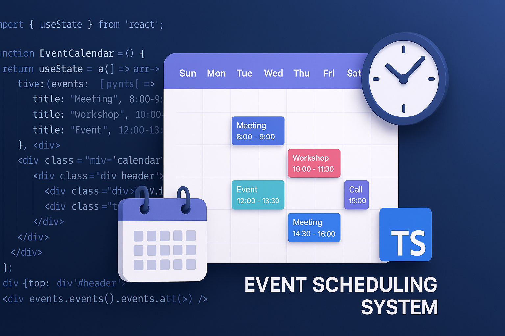

# TypeScript Event Scheduler

     

## 🖼️ Imagem Hero / Hero Image

Uma representação visual do sistema de agendamento de eventos em ação, destacando a interface moderna e funcionalidades avançadas. Esta imagem ilustra a capacidade do sistema de organizar e exibir eventos de forma clara e intuitiva.

A visual representation of the event scheduling system in action, highlighting its modern interface and advanced features. This image illustrates the system's ability to organize and display events clearly and intuitively.



Um **agendador de eventos robusto e flexível** desenvolvido em **TypeScript**, projetado para gerenciar compromissos e tarefas de forma eficiente. Este projeto exemplifica as **melhores práticas de desenvolvimento de software**, incluindo uma estrutura de código organizada, testes unitários abrangentes e documentação clara e bilíngue. Ideal para desenvolvedores que buscam um exemplo prático de aplicação de TypeScript em um contexto de gerenciamento de dados.

## Funcionalidades Principais

O `TypeScript Event Scheduler` oferece um conjunto completo de funcionalidades para a gestão de eventos:

- **Adicionar Eventos**: Registre novos eventos com identificador único (ID), nome, data e uma descrição opcional para detalhes adicionais.
- **Obter Eventos**: Recupere eventos específicos por ID ou liste todos os eventos existentes, que são automaticamente ordenados por data para facilitar a visualização.
- **Atualizar Eventos**: Modifique os detalhes de eventos já existentes, permitindo flexibilidade na gestão de compromissos.
- **Excluir Eventos**: Remova eventos do agendador de forma simples e direta.
- **Filtrar por Data**: Encontre rapidamente todos os eventos que ocorrem em uma data específica, otimizando a busca e organização.

## Estrutura do Projeto

A organização do projeto segue um padrão modular, facilitando a manutenção e a escalabilidade. Abaixo, um diagrama ilustra a estrutura de diretórios:


## Como Usar

Para começar a usar o `TypeScript Event Scheduler`, siga os passos abaixo:

### Instalação

Clone o repositório e instale as dependências:

```bash
git clone https://github.com/galafis/TypeScript-Event-Scheduler-Improved.git
cd TypeScript-Event-Scheduler-Improved
npm install
```

### Exemplos de Código

Demonstrações de como interagir com o `EventScheduler`:

```typescript
import EventScheduler from './src/EventScheduler';

const scheduler = new EventScheduler();

// Adicionar eventos
const event1 = {
  id: '1',
  name: 'Reunião de Equipe',
  date: new Date('2025-10-26T10:00:00Z'),
  description: 'Discussão do projeto X',
};
const event2 = { id: '2', name: 'Apresentação Cliente', date: new Date('2025-10-27T14:00:00Z') };
scheduler.addEvent(event1);
scheduler.addEvent(event2);

console.log('Todos os eventos:', scheduler.getAllEvents());

// Obter um evento
const retrievedEvent = scheduler.getEvent('1');
console.log('Evento 1:', retrievedEvent);

// Atualizar um evento
scheduler.updateEvent('1', { name: 'Reunião de Planejamento' });
console.log('Evento 1 atualizado:', scheduler.getEvent('1'));

// Obter eventos por data
const eventsToday = scheduler.getEventsByDate(new Date('2025-10-27T00:00:00Z'));
console.log('Eventos em 27/10/2025:', eventsToday);

// Excluir um evento
scheduler.deleteEvent('2');
console.log('Eventos após exclusão:', scheduler.getAllEvents());
```

## Testes

Para garantir a integridade e funcionalidade do projeto, execute os testes unitários com o seguinte comando:

```bash
npm test
```

## Contribuição

Contribuições são altamente valorizadas! Sinta-se à vontade para abrir issues para relatar bugs ou sugerir melhorias, e pull requests para implementar novas funcionalidades ou correções. Por favor, siga as diretrizes de contribuição do projeto.

## Licença

Este projeto está licenciado sob a licença MIT. Consulte o arquivo [LICENSE](LICENSE) para obter todos os detalhes.

---

# English Version

## TypeScript Event Scheduler

     

## 🖼️ Hero Image

A visual representation of the event scheduling system in action, highlighting its modern interface and advanced features. This image illustrates the system's ability to organize and display events clearly and intuitively.


A **robust and flexible event scheduler** developed in **TypeScript**, designed to efficiently manage appointments and tasks. This project exemplifies **software development best practices**, including an organized code structure, comprehensive unit tests, and clear, bilingual documentation. Ideal for developers seeking a practical example of TypeScript application in a data management context.

## Key Features

The `TypeScript Event Scheduler` offers a comprehensive set of functionalities for event management:

- **Add Events**: Register new events with a unique identifier (ID), name, date, and an optional description for additional details.
- **Get Events**: Retrieve specific events by ID or list all existing events, which are automatically sorted by date for easy viewing.
- **Update Events**: Modify the details of existing events, allowing flexibility in managing appointments.
- **Delete Events**: Remove events from the scheduler simply and directly.
- **Filter by Date**: Quickly find all events occurring on a specific date, optimizing search and organization.

## Project Structure

The project's organization follows a modular pattern, facilitating maintenance and scalability. Below, a diagram illustrates the directory structure:


## How to Use

To start using the `TypeScript Event Scheduler`, follow the steps below:

### Installation

Clone the repository and install dependencies:

```bash
git clone https://github.com/galafis/TypeScript-Event-Scheduler-Improved.git
cd TypeScript-Event-Scheduler-Improved
npm install
```

### Code Examples

Demonstrations of how to interact with the `EventScheduler`:

```typescript
import EventScheduler from './src/EventScheduler';

const scheduler = new EventScheduler();

// Add events
const event1 = {
  id: '1',
  name: 'Team Meeting',
  date: new Date('2025-10-26T10:00:00Z'),
  description: 'Project X discussion',
};
const event2 = { id: '2', name: 'Client Presentation', date: new Date('2025-10-27T14:00:00Z') };
scheduler.addEvent(event1);
scheduler.addEvent(event2);

console.log('All events:', scheduler.getAllEvents());

// Get an event
const retrievedEvent = scheduler.getEvent('1');
console.log('Event 1:', retrievedEvent);

// Update an event
scheduler.updateEvent('1', { name: 'Planning Meeting' });
console.log('Updated Event 1:', scheduler.getEvent('1'));

// Get events by date
const eventsToday = scheduler.getEventsByDate(new Date('2025-10-27T00:00:00Z'));
console.log('Events on 2025-10-27:', eventsToday);

// Delete an event
scheduler.deleteEvent('2');
console.log('Events after deletion:', scheduler.getAllEvents());
```

## Tests

To ensure the project's integrity and functionality, run the unit tests with the following command:

```bash
npm test
```

## Contributing

Contributions are highly valued! Feel free to open issues to report bugs or suggest improvements, and pull requests to implement new features or fixes. Please follow the project's contribution guidelines.

## License

This project is licensed under the MIT License. See the [LICENSE](LICENSE) file for full details.
