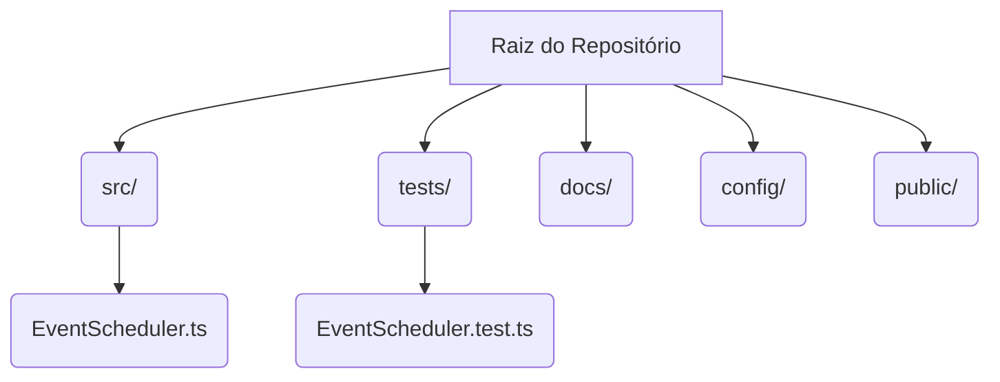
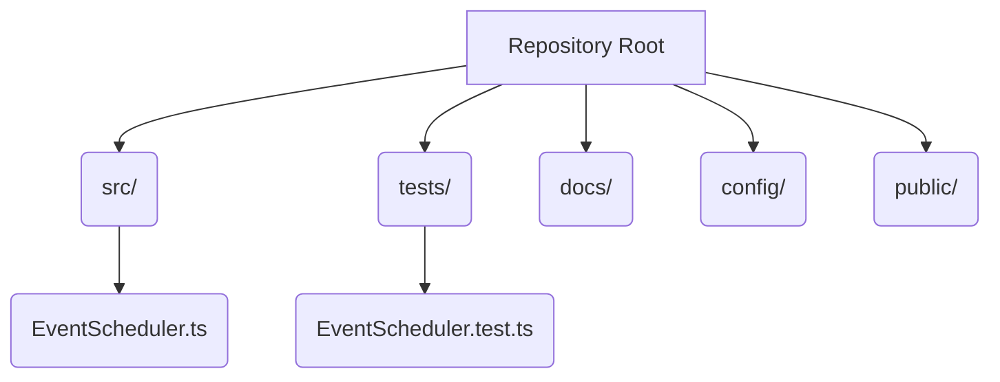

# TypeScript Event Scheduler

   

Um agendador de eventos robusto e flexível desenvolvido em TypeScript, projetado para gerenciar compromissos e tarefas de forma eficiente. Este projeto demonstra boas práticas de desenvolvimento, incluindo uma estrutura de código organizada, testes unitários abrangentes e documentação clara.

## Funcionalidades

- **Adicionar Eventos**: Registre novos eventos com ID, nome, data e descrição opcional.
- **Obter Eventos**: Recupere eventos por ID ou liste todos os eventos ordenados por data.
- **Atualizar Eventos**: Modifique detalhes de eventos existentes.
- **Excluir Eventos**: Remova eventos do agendador.
- **Filtrar por Data**: Encontre todos os eventos que ocorrem em uma data específica.

## Estrutura do Projeto



## Como Usar

### Instalação

```bash
git clone https://github.com/galafis/TypeScript-Event-Scheduler-Improved.git
cd TypeScript-Event-Scheduler-Improved
npm install
```

### Exemplos de Código

```typescript
import EventScheduler from './src/EventScheduler';

const scheduler = new EventScheduler();

// Adicionar eventos
const event1 = { id: '1', name: 'Reunião de Equipe', date: new Date('2025-10-26T10:00:00Z'), description: 'Discussão do projeto X' };
const event2 = { id: '2', name: 'Apresentação Cliente', date: new Date('2025-10-27T14:00:00Z') };
scheduler.addEvent(event1);
scheduler.addEvent(event2);

console.log('Todos os eventos:', scheduler.getAllEvents());

// Obter um evento
const retrievedEvent = scheduler.getEvent('1');
console.log('Evento 1:', retrievedEvent);

// Atualizar um evento
scheduler.updateEvent('1', { name: 'Reunião de Planejamento' });
console.log('Evento 1 atualizado:', scheduler.getEvent('1'));

// Obter eventos por data
const eventsToday = scheduler.getEventsByDate(new Date('2025-10-27T00:00:00Z'));
console.log('Eventos em 27/10/2025:', eventsToday);

// Excluir um evento
scheduler.deleteEvent('2');
console.log('Eventos após exclusão:', scheduler.getAllEvents());
```

## Testes

Para executar os testes unitários:

```bash
npm test
```

## Contribuição

Contribuições são bem-vindas! Sinta-se à vontade para abrir issues e pull requests.

## Licença

Este projeto está licenciado sob a licença MIT. Veja o arquivo [LICENSE](LICENSE) para mais detalhes.

---

# English Version

## TypeScript Event Scheduler

A robust and flexible event scheduler developed in TypeScript, designed to efficiently manage appointments and tasks. This project demonstrates good development practices, including an organized code structure, comprehensive unit tests, and clear documentation.

## Features

- **Add Events**: Register new events with ID, name, date, and optional description.
- **Get Events**: Retrieve events by ID or list all events sorted by date.
- **Update Events**: Modify details of existing events.
- **Delete Events**: Remove events from the scheduler.
- **Filter by Date**: Find all events occurring on a specific date.

## Project Structure



## How to Use

### Installation

```bash
git clone https://github.com/galafis/TypeScript-Event-Scheduler-Improved.git
cd TypeScript-Event-Scheduler-Improved
npm install
```

### Code Examples

```typescript
import EventScheduler from './src/EventScheduler';

const scheduler = new EventScheduler();

// Add events
const event1 = { id: '1', name: 'Team Meeting', date: new Date('2025-10-26T10:00:00Z'), description: 'Project X discussion' };
const event2 = { id: '2', name: 'Client Presentation', date: new Date('2025-10-27T14:00:00Z') };
scheduler.addEvent(event1);
scheduler.addEvent(event2);

console.log('All events:', scheduler.getAllEvents());

// Get an event
const retrievedEvent = scheduler.getEvent('1');
console.log('Event 1:', retrievedEvent);

// Update an event
scheduler.updateEvent('1', { name: 'Planning Meeting' });
console.log('Updated Event 1:', scheduler.getEvent('1'));

// Get events by date
const eventsToday = scheduler.getEventsByDate(new Date('2025-10-27T00:00:00Z'));
console.log('Events on 2025-10-27:', eventsToday);

// Delete an event
scheduler.deleteEvent('2');
console.log('Events after deletion:', scheduler.getAllEvents());
```

## Tests

To run the unit tests:

```bash
npm test
```

## Contributing

Contributions are welcome! Feel free to open issues and pull requests.

## License

This project is licensed under the MIT License. See the [LICENSE](LICENSE) file for more details.

